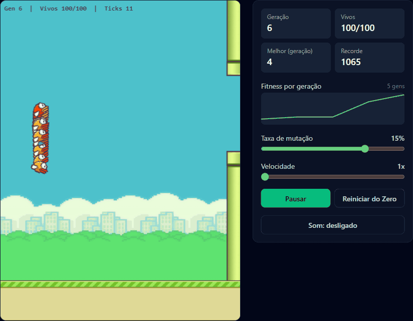
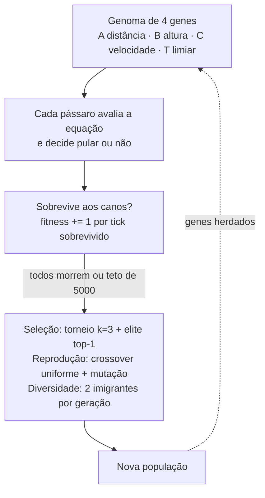

# genetic-flappy-bird — Algoritmo Genético aprendendo a jogar Flappy Bird

[](https://nextjs.org/)
[](https://www.typescriptlang.org/)
[](#)
[](#)
[](https://genetic-flappy-bird.vercel.app)
[](public/LICENSE)

> ### 🟢 Live Demo
>
> ## [Abrir: genetic-flappy-bird.vercel.app](https://genetic-flappy-bird.vercel.app)
>
> Puxe **Velocidade** para 20x e veja a população evoluir em segundos —
> sobe a taxa de mutação para 15% e compara a curva na sparkline.



## O que é

Uma simulação interativa em que **100 pássaros aprendem a jogar Flappy Bird
por evolução** — sem redes neurais, sem bibliotecas de física, sem engine de
jogo: TypeScript puro (física e GA testáveis em Node) + Canvas 2D no browser.

Cada pássaro decide pular avaliando uma **equação linear** cujos 4
coeficientes são seus genes (iniciados em `[-1, 1]`, clampados em `[-10, 10]`):

```text
inputX   = (distância X até o próximo cano) / largura do mundo
inputY   = (altura do pássaro - centro do gap) / altura do mundo
inputVel = velocidade Y / velocidade terminal

resultado = inputX·geneA + inputY·geneB + inputVel·geneC
pula se resultado > geneT
```

## Arquitetura

O ciclo do GA e o que ele faz com os pássaros:



## Números

| Item | Valor |
|------|-------|
| População | 100 pássaros por geração |
| Genes do "cérebro" | 4 (`geneA`, `geneB`, `geneC`, `geneT`) |
| Mundo lógico | 480 × 640 px (física independente de tela/dPR) |
| Teto por geração | 5.000 ticks (~83s a 1x) |
| Testes | 15 (unit + integração 50 gerações × 5 seeds) |
| Assets | 12 sprites + 4 sons (MIT) |

## Controles

- **Taxa de mutação** (1–20%), **Velocidade** (1–20x)
- **Pausar/Retomar** (sem fast-forward ao despausar), **Reiniciar do Zero**
- **Som** (desligado por padrão — o clique no botão é o gesto que libera o áudio)
- **Sparkline** do melhor fitness por geração

## Nota de comportamento

Depois que a evolução **resolve** (uma geração atinge o teto de 5000 ticks),
cada geração seguinte em que o elite sobrevive consome os 5000 ticks — ~83s a
1x, ~4s a 20x. Comportamento esperado, não bug.

## Desenvolvimento

### Rodar local

```powershell
npm install
npm run dev                        # http://localhost:3000
```

### Verificação

```powershell
npm test                           # vitest: 15 testes (unit + integração)
npm run lint                       # eslint .
npm run typecheck                  # tsc --noEmit (strict + noUncheckedIndexedAccess)
npm run build                      # build Next/Turbopack de produção
```

### Estrutura

```text
src/app/page.tsx                          # página + link do repositório
src/components/GeneticFlappySimulator.tsx # loop rAF + acumulador + preload de assets
src/components/ControlPanel.tsx           # stats, sparkline, sliders, som
src/lib/engine.ts                         # Simulation: física, colisão, fitness, evolve
src/lib/genetics.ts                       # torneio, crossover, mutação, mulberry32
src/lib/renderer.ts                       # draw() puro (sprites + fallback planas)
src/lib/assets.ts                         # preload dos sprites (client-only)
src/lib/audio.ts                          # AudioManager (pool + cooldown por som)
src/lib/config.ts, src/lib/types.ts       # constantes e contratos
tests/                                    # 15 testes vitest (headless, seeds fixos)
docs/PLAN.md                              # plano técnico completo
docs/assets/demo.gif                      # GIF de demo do README
public/sprites/, public/audio/            # assets (MIT, ver public/LICENSE)
```

Plano completo de implementação em [`docs/PLAN.md`](docs/PLAN.md).

## Créditos

Sprites e efeitos sonoros de
[samuelcust/flappy-bird-assets](https://github.com/samuelcust/flappy-bird-assets) —
**MIT**, © 2019 Samuel Custódio (cópia verbatim em
[`public/LICENSE`](public/LICENSE)). O cenário (dia/noite) é sorteado a cada
reload; a aparência de cada pássaro é sorteada no nascimento e fixa até a morte.
